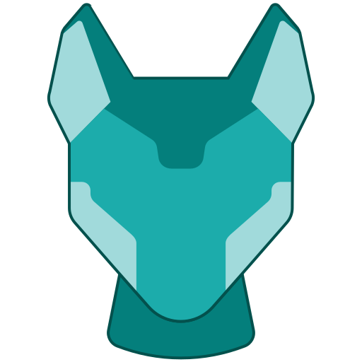

<div align="center">
  
  <h1>Flipstarter</h1>
</div>

Flipstarter provides a way for any project to engage with potential funders in a way that encourages accountability for projects and fairness for funders.

*The Flipstarter team has created these tools for anyone to use.
Although we have worked hard to make Flipstarter easy to deploy and reliable to operate, the tools are offered as-is with no expectation of support.
If you are not confident about your ability to deploy and manage a Flipstarter-based campaign, we recommend you work with a web developer who can manage everything for you.*

*Corentin Mercier offers a service [here](https://merc1er.com/flipstarter).*

Note: Although this repository is called "backend", it currently contains both the backend and frontend code.
The code for the Electron Cash plugin is [here](https://gitlab.com/flipstarter/flipstarter-electron-cash).


## Development

### Run the NodeJS development server

You need [NodeJS](https://nodejs.org/en/) installed on your machine, then run:

```shell
npm install
npm start

# or on windows:
npm run start-no-debug
```

And open up [localhost:3000](http://localhost:3000) in your browser.

### Run the Docker container

You need [Docker](https://www.docker.com) installed on your machine, then run:

```shell
docker build -t flipstarter .
docker volume create flipstarter
docker run -v flipstarter:/app/static/campaigns -p 3000:3000 flipstarter
```

And open up [localhost:3000](http://localhost:3000) in your browser.

### Contribute

The Flipstarter team is a group of volunteers, and we welcome contributions.

General guidelines:

- Submit merge requests for the campaign backend and frontend [here](https://gitlab.com/flipstarter/backend/-/merge_requests).
- Submit merge requests for the Electron Cash plugin [here](https://gitlab.com/flipstarter/flipstarter-electron-cash/-/merge_requests).
- Keep each change minimal and self-contained. Note that "minimal" does not always mean small, but usually it does.
- Avoid mixing moving stuff around with changing stuff. Do changes with renames on their own.
- Code review is an important part of the development process. Contributors and maintainers should expect constructive communication from each other.
- In some cases, merge requests are rejected. It is up to the MR author to convince the reviewers that the changes warrant the review effort.

Suggested workflow:

1. Find or create an issue describing a need or problem that needs to be solved.
1. [Optional] If you are interested in a bounty, please follow this guideline. Please note that although maintainers try to be realistic about bounty expectations, sometimes MRs are not accepted, and final payout of a bounty depends only on approval and merge of changes.
    1. Create a thread on the issue to discuss your proposal and bounty.
    1. Propose a problem to be solved (any clarification to the issue), the outline of a solution and a bounty.
        - Bounties are only paid in Bitcoin Cash.
        - Bounties are typically denominated in USD.
        - BCH conversion rates are determined at the time of transfer, typically by the Electron Cash wallet's price source.
    1. Review and revise the proposal with the maintainers.
    1. Flipstarter team pays the bounty from public donations only after a successful review, revision and merge process.
1. Create a Merge/Pull Request with the proposed changes.
1. Work with maintainers to review and revise the proposed changes.
1. Maintainers merge changes if/when they meet Flipstarter needs.


#### Edit front-end

##### HTML

HTML files are located in `/views/`.

##### CSS/images/fonts

These are located in `/static/`, in their respective folder.

##### JavaScript (front-end)

To edit the main application script, edit `/source.js` and run `/webpack.sh` to process it.

⚠️ Do NOT edit `application.js` directly ⚠️

##### add new languages

[How you can add new languages](./static/ui/languages.md)

## Deploy to production

There are multiple ways to do this.

1. Use [Digital Ocean Marketplace](https://marketplace.digitalocean.com/apps/flipstarter)
2. Use a NodeJS image and serve `server.js` on port 80 or 443. You can also use a process manager like [pm2](https://pm2.keymetrics.io)
3. Deploy the docker container on port 80 or 443 using the following commands:

```
# download the latest version of flipstarter
docker pull flipstarter/flipstarter

# create a volume to store the database
docker volume create flipstarter

# run the container on ports 443 and 80
docker run -d --restart always --name flipstarter -v flipstarter:/app/static/campaigns -p 443:3000 -p 80:3000 flipstarter/flipstarter
```

You can start and stop the container with `docker [start/stop] flipstarter`.

## Add a TLS/SSL certificate

**If you deployed the app via [Digital Ocean Marketplace](https://marketplace.digitalocean.com/apps/flipstarter) (method 1), follow the steps:**

1. Point your domain name (or subdomain) to the IP address of the host using an "A" record. See instructions for [NameCheap](https://www.namecheap.com/support/knowledgebase/article.aspx/319/2237/how-can-i-set-up-an-a-address-record-for-my-domain), [Cloudflare](https://support.cloudways.com/creating-a-record-cloudflare/) or [GoDaddy](https://www.godaddy.com/help/add-an-a-record-19238).
2. Then, [access your server via SSH](https://www.digitalocean.com/docs/droplets/how-to/connect-with-ssh/) and run the following commands:

```shell
sudo add-apt-repository ppa:certbot/certbot
sudo apt-get update
sudo apt-get install python-certbot-nginx
sudo certbot --nginx -d yourdomain.com
```

Make sure to replace `yourdomain.com` with your own domain or subdomain.  
Fill in the information, and select `2` when asked if you want HTTP traffic redirected to HTTPS.

Try reloading your campaign. Your browser should automatically show that the connection to the website is secure.

**If you used method 2 or 3:**

1. Install Nginx, Apache or similar software.
2. Run the Flipstarter Docker container on an available port - for example port 3000 (`docker run -d --restart always --name flipstarter -v flipstarter:/app/static/campaigns -p 3000:3000 flipstarter/flipstarter`).
3. Create a reverse proxy to serve port 3000 via Nginx/Apache.
4. Install [certbot](https://certbot.eff.org) and run it according to your OS and web server.
